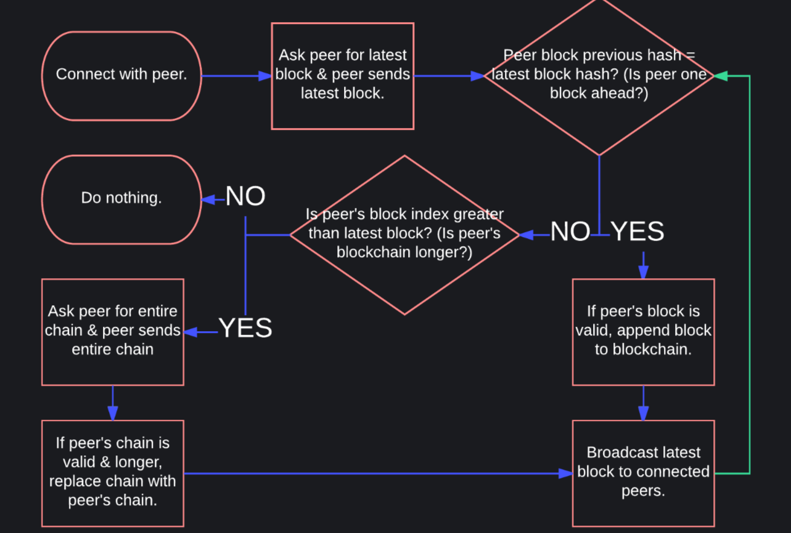

# Block Chain

<hr>
A blockchain is a distributed database secured by cryptography. It is the technology behind Bitcoin.

-> A blockchain has a list of blocks. <br>
-> It starts with a single block, called the genesis block

```

const Block = require("./Block.js");

class Blockchain {
  constructor () {
    this.blockchain = [Block.genesis()];
  }

  get() {
    return this.blockchain;
  }

  get latestBlock() {
    return this.blockchain[this.blockchain.length - 1];
  }
};

module.exports = Blockchain;

```

## Block

-> Each block stores the following information:

- Index
- Timestamp
- Hash
- Previous Hash
- Data
- Nonce

```
class Block {
  constructor (index, previousHash, timestamp, data, hash, nonce) {
    this.index = index;
    this.previousHash = previousHash;
    this.timestamp = timestamp;
    this.data = data;
    this.hash = hash;
    this.nonce = nonce;
  }

  get genesis() {
    new Block(
      0,
      "0",
      1508270000000,
      "Welcome to Blockchain Demo 2.0!",
      "000dc75a315c77a1f9c98fb6247d03dd18ac52632d7dc6a9920261d8109b37cf",
      604
    );
  }
}

module.exports = Block;
```
## Index

The index is the position of the block in the chain.

The genesis block has an index of 0. The next block will have an index of 1.

## TIMESTAMP 

A record of when the block was created.

The timestamp helps to keep the blockchain in order.

## HASH 
A hash looks like a bunch of random numbers and letters.

It is a alphanumeric value that uniquely identifies data, or the "digital fingerprint" of data.

Properties of a hash:
- Hash has a fixed length.
- Same data always maps to same hash.
- Different data always maps to a different hash (within practical limitations).
- Is easy to compute.
- Is infeasible to convert hash to data.
- A small change in data leads to a large change in hash.

##  VALID HASH 

A valid hash for a blockchain is a hash that meets a certain requirement. For this blockchain, having three zeros at the beginning of the hash is the requirement for a valid hash.

The number of leading zeros required is the difficulty.

```
// cosnt Block = reuqire("./Block.js");

// class Blockchain {
  // constructor() {
    // this.blockchain = [Block.genesis()];
    this.difficulty = 3;
  // }
  
  // get() { ... }
  // get latestBlock() { ... }

  isValidHashDifficulty(hash) {
    for (var i = 0; i < hash.length; i++) {
      if (hash[i] !== "0") {
        break;
      };
    }
    return i >= this.difficulty;
  }
// };

// module.exports = Blockchain;
```


## BLOCK HASH CALCULATION 
A hashing function takes data as input, and returns a unique hash.

f ( data ) = hash

Since the hash is a "digital fingerprint" of the entire block, the data is the combination of ```index, timestamp, previous hash, block data, and nonce ```.

f ( index + previous hash + timestamp + data + nonce ) = hash

Replace the values for our genesis block, we get:

f ( 0 + "0" + 1508270000000 + "Welcome to Blockchain Demo 2.0!" + 604 ) = 000dc75a315c77a1f9c98fb6247d03dd18ac52632d7dc6a9920261d8109b37cf

```
// const Block = require("./Block.js");
const crypto = require("crypto");

// class Blockchain {
  // constructor() { ... }
  // get() { ... }
  // get latestBlock() { ... }
  // isValidHashDifficulty(hash) { ... }

  calculateHashForBlock(block) {
    const { index, previousHash, timestamp, transactions, nonce } = block;
    return this.calculateHash(
      index,
      previousHash,
      timestamp,
      transactions,
      nonce
    );
  }

  calculateHash(index, previousHash, timestamp, data, nonce) {
    return crypto
      .createHash("sha256") // SHA256 Hash Function
      .update(index + previousHash + timestamp + data + nonce)
      .digest("hex");
  }
// };

// module.exports = Blockchain;
```

##  PREVIOUS HASH 
The previous hash is the hash of the previous block.

The genesis block's previous hash is "0" because there is no previous block.

##  DATA 
Each block can store data against it.

In cryptocurrencies such as Bitcoin, the data would include money transactions.

##  NONCE 
The nonce is the number used to find a valid hash.

To find a valid hash, we need to find a nonce value that will produce a valid hash when used with the rest of the information from that block.

```
// const Block = require("./Block.js");
// const crypto = require("crypto");

// class Blockchain {
  // constructor() { ... }
  // get() { ... }
  // get latestBlock() { ... }
  // isValidHashDifficulty(hash) { ... }
  // calculateHashForBlock(block) { ... }
  // calculateHash(...) { ... }
  // mine(data) { ... }

  generateNextBlock(data) {
    const nextIndex = this.latestBlock.index + 1;
    const previousHash = this.latestBlock.hash;
    let timestamp = new Date().getTime();
    let nonce = 0;
    let nextHash = this.calculateHash(
      nextIndex,
      previousHash,
      timestamp,
      data,
      nonce
    );

    while (!this.isValidHashDifficulty(nextHash)) {
      nonce = nonce + 1;
      timestamp = new Date().getTime();
      nextHash = this.calculateHash(
        nextIndex,
        previousHash,
        timestamp,
        data,
        nonce
      );
    }

    const nextBlock = new Block(
      nextIndex,
      previousBlock.hash,
      nextTimestamp,
      data,
      nextHash,
      nonce
    );

    return nextBlock;
  }
// };

// module.exports = Blockchain;
```

##  MINING A BLOCK 
The process of determining this nonce is called mining.

We start with a nonce of 0 and keep incrementing it by 1 until we find a valid hash.

As difficulty increases, the number of possible valid hashes decreases. With fewer possible valid hashes, it takes more processing power to find a valid hash.

If the hash on the block is invalid, click on the tool button to mine the genesis block!

```
// const Block = require("./Block.js");
// const crypto = require("crypto");

// class Blockchain {
  // constructor() { ... }
  // get() { ... }
  // get latestBlock() { ... }
  // isValidHashDifficulty(hash) { ... }
  // calculateHashForBlock(block) { ... }
  // calculateHash(...) { ... }

  mine(data) {
    const newBlock = this.generateNextBlock(data);
    try {
      this.addBlock(newBlock);
    } catch (err) {
      throw err;
    };
  }
// };

// module.exports = Blockchain;
```

##   MUTATION EFFECT 
Subsequent blocks will also be invalid.

A hash change will cause a mutation in the previous hash of subsequent blocks. Since previous hash is used to calculate the hash, subsequent hashes will also change.

This will lead to a cascading invalidation of blocks.

Try it yourself:

Add 3 blocks, then mutate the genesis block input.

##  ADDING A NEW BLOCK 
To mine another block to the blockchain, fill out the data input and click the button.

```
// const Block = require("./Block.js");
// const crypto = require("crypto");

// class Blockchain {
  // constructor() { ... }
  // get() { ... }
  // get latestBlock() { ... }
  // isValidHashDifficulty(hash) { ... }
  // calculateHashForBlock(block) { ... }
  // calculateHash(...) { ... }
  // mine(data) { ... }
  // generateNextBlock(data) { ... }

  addBlock(newBlock) {
    if (this.isValidNewBlock(newBlock, this.latestBlock)) {
      this.blockchain.push(newBlock);
    } else {
      throw "Error: Invalid block";
    }
  }
// };

// module.exports = Blockchain;
```

##  ADDING VALID BLOCKS 
When adding a new block to the blockchain, the new block needs to meet these requirements.

- Block index one greater than latest block index.
- Block previous hash equal to latest block hash.
- Block hash meets difficulty requirement.
- Block hash is correctly calculated.

Other peers on the network will be adding blocks to the blockchain, so new blocks need to be validated.

```
// const Block = require("./Block.js");
// const crypto = require("crypto");

// class Blockchain {
  // constructor() { ... }
  // get() { ... }
  // get latestBlock() { ... }
  // isValidHashDifficulty(hash) { ... }
  // calculateHashForBlock(block) { ... }
  // calculateHash(...) { ... }
  // mine(data) { ... }
  // generateNextBlock(data) { ... }
  // addBlock(newBlock) { ... }

  isValidNextBlock(nextBlock, previousBlock) {
    const nextBlockHash = this.calculateHashForBlock(nextBlock);

    if (previousBlock.index + 1 !== nextBlock.index) {
      return false;
    } else if (previousBlock.hash !== nextBlock.previousHash) {
      return false;
    } else if (nextBlockHash !== nextBlock.hash) {
      return false;
    } else if (!this.isValidHashDifficulty(nextBlockHash)) {
      return false;
    } else {
      return true;
    }
  }
// };

// module.exports = Blockchain;
```

##  PEER-TO-PEER NETWORK 
A global network of computers work together to keep the blockchain secure, correct, and consistent.

```
const wrtc = require('wrtc');
const Exchange = require('peer-exchange');
const p2p = new Exchange("Blockchain Demo 2.0", { wrtc: wrtc });
const net = require("net");

class PeerToPeer {
  constructor(blockchain) {
    this.peers = [];
    this.blockchain = blockchain;
  }

  startServer(port) {
    const server = net
      .createServer(socket =>
        p2p.accept(socket, (err, conn) => {
          if (err) {
            throw err;
          } else {
            this.initConnection.call(this, conn);
          }
        })
      )
      .listen(port);
  }
}
  
module.exports = PeerToPeer;
```

## Add Peer

```
// const wrtc = require('wrtc');
// const Exchange = require('peer-exchange');
// const p2p = new Exchange(...);
// const net = require("net");

// class PeerToPeer {
  // constructor(blockchain) { ... }
  // startServer(port) { ... }
  
  discoverPeers() {
    p2p.getNewPeer((err, conn) => {
      if (err) {
        throw err;
      } else {
        this.initConnection.call(this, conn);
      }
    });
  }
// }
  
// module.exports = PeerToPeer;
```

## Peer Status

Peers have three states:

- Currently Active
- Connected
- Disconnected

```
// const wrtc = require('wrtc');
// const Exchange = require('peer-exchange');
// const p2p = new Exchange(...);
// const net = require("net");

// class PeerToPeer {
  // constructor(blockchain) { ... }
  // startServer(port) { ... }
  // discoverPeers() { ... }

  connectToPeer(host, port) {
    const socket = net.connect(port, host, () =>
      p2p.connect(socket, (err, conn) => {
        if (err) {
          throw err;
        } else {
          this.initConnection.call(this, conn);
        }
      })
    );
  }

  closeConnection() {
    p2p.close(err => {
      throw err;
    })
  }
// }

// module.exports = PeerToPeer;
```
## PEER MESSAGES 
Peers ask for each other's blocks to determine who has the most up-to-date blockchain.

```
// const wrtc = require('wrtc');
// const Exchange = require('peer-exchange');
// const p2p = new Exchange(...);
// const net = require("net");
const messageType = {
  REQUEST_LATEST_BLOCK: 0,
  RECEIVE_LATEST_BLOCK: 1,
  REQUEST_BLOCKCHAIN: 2,
  RECEIVE_BLOCKCHAIN: 3,
};
const {
  REQUEST_LATEST_BLOCK,
  RECEIVE_LATEST_BLOCK,
  REQUEST_BLOCKCHAIN,
  RECEIVE_BLOCKCHAIN,
  REQUEST_TRANSACTIONS,
  RECEIVE_TRANSACTIONS
} = messageType;

// class PeerToPeer { ... }
// module.exports = PeerToPeer;

class Messages {
  static getLatestBlock() {
    return {
      type: REQUEST_LATEST_BLOCK
    };
  }

  static sendLatestBlock(block) {
    return {
      type: RECEIVE_LATEST_BLOCK,
      data: block
    };
  }

  static getBlockchain() {
    return {
      type: REQUEST_BLOCKCHAIN
    };
  }

  static sendBlockchain(blockchain) {
    return {
      type: RECEIVE_BLOCKCHAIN,
      data: blockchain
    };
  }
}
```

## PEER COMMUNICATION 



```
// const wrtc = require('wrtc');
// const Exchange = require('peer-exchange');
// const p2p = new Exchange(...);
// const net = require("net");
// const messageType = { ... };
// const { ... } = messageType;

// class PeerToPeer {
  // constructor(blockchain) { ... }
  // startServer(port) { ... }
  // discoverPeers() { ... }
  // connectToPeer(host, port) { ... }
  // closeConnection() { ... }

  broadcastLatest() {
    this.broadcast(Messages.sendLatestBlock(this.blockchain.latestBlock));
  }

  broadcast(message) {
    this.peers.forEach(peer => this.write(peer, message));
  }

  write(peer, message) {
    peer.write(JSON.stringify(message));
  }

  initConnection(connection) {
    this.peers.push(connection);
    this.initMessageHandler(connection);
    this.initErrorHandler(connection);
    this.write(connection, Messages.getLatestBlock());
  }

  initMessageHandler(connection) {
    connection.on("data", data => {
      const message = JSON.parse(data.toString("utf8"));
      this.handleMessage(connection, message);
    });
  }

  initErrorHandler(connection) {
    connection.on("error", err => {
      throw err;
    });
  }

  handleMessage(peer, message) {
    switch (message.type) {
      case REQUEST_LATEST_BLOCK:
        this.write(peer, Messages.sendLatestBlock(this.blockchain.latestBlock));
        break;
      case REQUEST_BLOCKCHAIN:
        this.write(peer, Messages.sendBlockchain(this.blockchain.get()));
        break;
      case RECEIVE_LATEST_BLOCK:
        this.handleReceivedLatestBlock(message, peer);
        break;
      case RECEIVE_BLOCKCHAIN:
        this.handleReceivedBlockchain(message);
        break;
      default:
        throw "Received invalid message.";
    }
  }
// }

// module.exports = PeerToPeer;
// class Messages { ... }
```

##  IMMUTABILITY 
If a block is mutated, the block, and subsequent blocks become invalid.

Invalid blocks are rejected by the peers on the network. They need to be re-mined to be valid.

Earlier blocks will be harder to corrupt because there are more subsequent invalid blocks to re-mine.

Because peers on the network are always adding new valid blocks, the hacker would have to outmine the network, which requires majority processing power.

##  51% ATTACK 
If a participant has more than 51% of the network, he could out-mine the network and hack the blockchain.

When there are more miners in the network, the processing power becomes more distributed and no one has majority power. This leads to a more secure blockchain.


